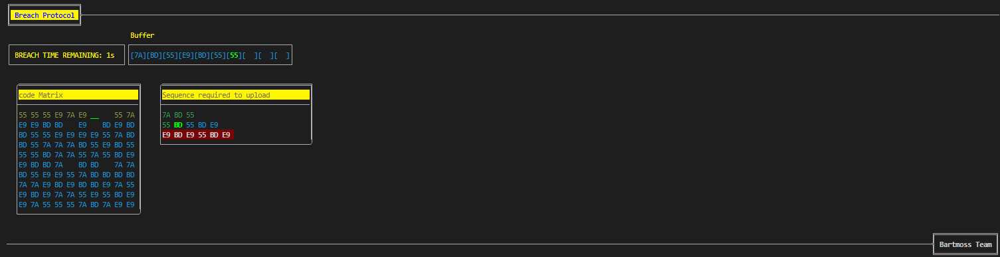
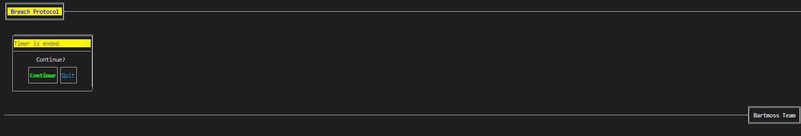

# Breach Protocol

Breach Protocol is a terminal UI game inspired by the hacking minigame from Cyberpunk 2077. This game challenges you to match sequences and breach systems in a cyberpunk-themed environment, all within your terminal.


## Screenshots





## Features

- **Terminal UI**: Immerse yourself in a cyberpunk world right from your terminal, based on [Charms](https://charms.sh).
- **Sequence Matching**: Solve puzzles and breach systems, just like in Cyberpunk 2077.
- TODO: **Cross-Platform**: Play on Linux, macOS, or Windows.
- **Multiple Installation Options**: Install via Go, Docker, or download the binary directly.

## Installation

### Using Go

To install the game using Go, make sure you have Go installed on your system, then run:

```bash
go install github.com/franciscolkdo/breach-protocol@latest
```

### Using Docker

You can also run the game using Docker:

```bash
docker run --rm -it franciscolkdo/breach-protocol
```

### Direct Download

If you prefer, you can download the binary directly from the [releases page](https://github.com/franciscolkdo/breach-protocol/releases):

1. Download the binary for your platform.
2. Make it executable (if on Linux or macOS):

    ```bash
    chmod +x breach-protocol
    ```

3. Run the game:

    ```bash
    ./breach-protocol
    ```

## How to Play

1. Launch the game via terminal.
2. Match the sequences and breach the system (use arrows and enter keys).
3. Enjoy the game and see how many systems you can breach!

## Contributing

Contributions are welcome! Feel free to fork this repository and submit a pull request.

## License

this project use MIT license